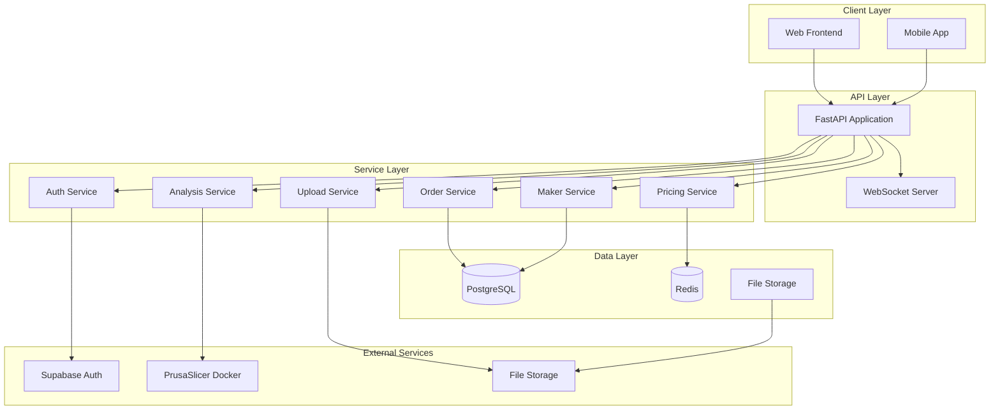

# Swift Prints Backend Documentation

Welcome to the comprehensive documentation for the Swift Prints 3D printing marketplace backend. This documentation provides everything you need to understand, deploy, and maintain the Swift Prints platform.

## 📚 Documentation Overview

### Quick Start

- **[Developer Setup Guide](DEVELOPER_SETUP.md)** - Get up and running in minutes
- **[API Documentation](API_DOCUMENTATION.md)** - Complete API reference with examples
- **[Configuration Guide](CONFIGURATION.md)** - Environment and configuration options

### Deployment & Operations

- **[Deployment Guide](DEPLOYMENT.md)** - Production deployment and scaling strategies
- **[Troubleshooting Guide](TROUBLESHOOTING.md)** - Common issues and solutions
- **[User Guides](USER_GUIDES.md)** - Customer and maker workflow documentation

## 🚀 Quick Start

### Prerequisites

- Python 3.10+
- Docker and Docker Compose
- Redis
- PostgreSQL (production) or SQLite (development)

### 5-Minute Setup

```bash
# Clone and setup
git clone <repository-url>
cd swift-prints/apps/backend

# Create virtual environment
python -m venv venv
source venv/bin/activate  # On Windows: venv\Scripts\activate

# Install dependencies
pip install -r requirements.txt

# Setup environment
cp .env.example .env
# Edit .env with your configuration

# Start services
docker-compose -f docker-compose.dev.yml up -d

# Initialize database
alembic upgrade head

# Start development server
uvicorn main:app --reload
```

Visit `http://localhost:8000/docs` for the interactive API documentation.

## 🏗️ Architecture Overview

The Swift Prints backend is built with:

- **FastAPI** - Modern, fast web framework for building APIs
- **SQLAlchemy** - SQL toolkit and ORM
- **Supabase Auth** - Authentication and user management
- **Redis** - Caching and session storage
- **Celery** - Asynchronous task processing
- **PrusaSlicer** - STL file analysis in Docker containers
- **WebSockets** - Real-time updates and notifications

### System Components



## 📖 Documentation Structure

### For Developers

| Document                                  | Purpose                             | Audience                           |
| ----------------------------------------- | ----------------------------------- | ---------------------------------- |
| [Developer Setup](DEVELOPER_SETUP.md)     | Local development environment setup | Developers                         |
| [API Documentation](API_DOCUMENTATION.md) | Complete API reference and examples | Frontend developers, API consumers |
| [Configuration](CONFIGURATION.md)         | Environment variables and settings  | DevOps, System administrators      |
| [Troubleshooting](TROUBLESHOOTING.md)     | Common issues and debugging         | Developers, Support team           |

### For Operations

| Document                                                           | Purpose                            | Audience                      |
| ------------------------------------------------------------------ | ---------------------------------- | ----------------------------- |
| [Deployment Guide](DEPLOYMENT.md)                                  | Production deployment strategies   | DevOps, System administrators |
| [Monitoring & Scaling](DEPLOYMENT.md#monitoring-and-observability) | Performance monitoring and scaling | Operations team               |
| [Security Guide](DEPLOYMENT.md#security-considerations)            | Security best practices            | Security team, DevOps         |

### For Users

| Document                                               | Purpose                      | Audience                |
| ------------------------------------------------------ | ---------------------------- | ----------------------- |
| [User Guides](USER_GUIDES.md)                          | Customer and maker workflows | End users, Support team |
| [API Examples](API_DOCUMENTATION.md#sdks-and-examples) | Integration examples         | Third-party developers  |

## 🔧 Key Features

### File Processing

- **Two-phase upload** system for large files
- **STL analysis** using PrusaSlicer in Docker
- **Multiple storage backends** (local, S3)
- **File validation** and security scanning

### Maker Management

- **Comprehensive profiles** with capabilities and ratings
- **Location-based search** with radius filtering
- **Real-time availability** tracking
- **Automated order assignment**

### Order Processing

- **End-to-end workflow** from upload to delivery
- **Real-time status updates** via WebSockets
- **Quality assurance** and review system
- **Dispute resolution** mechanisms

### Pricing Engine

- **Dynamic pricing** based on complexity and availability
- **Multi-factor calculations** (material, labor, complexity)
- **Caching layer** for performance
- **Market rate integration**

## 🛠️ Development Workflow

### Local Development

```bash
# Start development environment
docker-compose -f docker-compose.dev.yml up -d

# Run with hot reload
uvicorn main:app --reload --log-level debug

# Run tests
pytest --cov=app

# Code formatting
black app/
isort app/

# Type checking
mypy app/
```

### Testing

```bash
# Run all tests
pytest

# Run specific test file
pytest tests/test_auth.py

# Run with coverage
pytest --cov=app --cov-report=html

# Integration tests
pytest tests/integration/
```

### Database Management

```bash
# Create migration
alembic revision --autogenerate -m "Add new feature"

# Apply migrations
alembic upgrade head

# Rollback migration
alembic downgrade -1
```

## 🚀 Deployment Options

### Docker (Recommended)

```bash
# Build and deploy
docker-compose -f docker-compose.production.yml up -d
```

### Kubernetes

```bash
# Apply configurations
kubectl apply -f k8s/
```

### Cloud Platforms

- **AWS ECS/Fargate** - Serverless container deployment
- **Google Cloud Run** - Fully managed serverless platform
- **Azure Container Instances** - Simple container deployment

## 📊 Monitoring and Observability

### Health Checks

- **Application health**: `/health` endpoint
- **Database connectivity**: Connection pool monitoring
- **External services**: Supabase, Redis, storage backends
- **Background tasks**: Celery worker health

### Metrics

- **Request metrics**: Response times, error rates
- **Business metrics**: Orders, uploads, maker activity
- **System metrics**: CPU, memory, disk usage
- **Custom metrics**: Print success rates, customer satisfaction

### Logging

- **Structured logging** with JSON format
- **Log levels**: DEBUG, INFO, WARNING, ERROR, CRITICAL
- **Request tracing** with correlation IDs
- **Error tracking** with Sentry integration

## 🔒 Security

### Authentication & Authorization

- **JWT-based authentication** via Supabase
- **Role-based access control** (customer, maker, admin)
- **API key management** for external integrations
- **Session management** with secure cookies

### Data Protection

- **Input validation** and sanitization
- **SQL injection prevention** with parameterized queries
- **File upload security** with type validation and scanning
- **Data encryption** at rest and in transit

### Infrastructure Security

- **HTTPS enforcement** with proper SSL/TLS configuration
- **CORS policies** for cross-origin requests
- **Rate limiting** to prevent abuse
- **Security headers** (HSTS, CSP, etc.)

## 📈 Performance

### Optimization Strategies

- **Database indexing** for frequently queried columns
- **Connection pooling** for database connections
- **Redis caching** for expensive computations
- **Async processing** for long-running tasks

### Scaling Considerations

- **Horizontal scaling** with multiple application instances
- **Database read replicas** for read-heavy workloads
- **CDN integration** for static file delivery
- **Load balancing** for traffic distribution

## 🤝 Contributing

### Development Process

1. Fork the repository
2. Create a feature branch
3. Make your changes
4. Add tests for new functionality
5. Ensure all tests pass
6. Submit a pull request

### Code Standards

- **PEP 8** compliance for Python code
- **Type hints** for all function signatures
- **Docstrings** for all public functions and classes
- **Test coverage** of at least 80%

### Review Process

- **Automated checks**: Linting, type checking, security scanning
- **Test requirements**: All tests must pass
- **Code review**: At least one approval required
- **Documentation**: Update docs for new features

## 📞 Support

### Getting Help

1. **Documentation**: Check this documentation first
2. **Search Issues**: Look for existing solutions
3. **Community**: Ask questions in community forums
4. **Support Team**: Contact for critical issues

### Reporting Issues

When reporting issues, please include:

- **Environment details**: OS, Python version, dependencies
- **Error messages**: Complete stack traces
- **Steps to reproduce**: Exact commands and inputs
- **Expected behavior**: What should have happened

### Emergency Contacts

- **Production Issues**: [emergency-contact]
- **Security Issues**: [security-contact]
- **General Support**: [support-contact]

## 📄 License

This project is licensed under the MIT License. See the LICENSE file for details.

## 🙏 Acknowledgments

- **FastAPI** team for the excellent web framework
- **Supabase** for authentication services
- **PrusaSlicer** team for the slicing engine
- **Open source community** for the amazing tools and libraries

---

**Last Updated**: January 2024  
**Version**: 1.0.0  
**Maintainers**: Swift Prints Development Team
